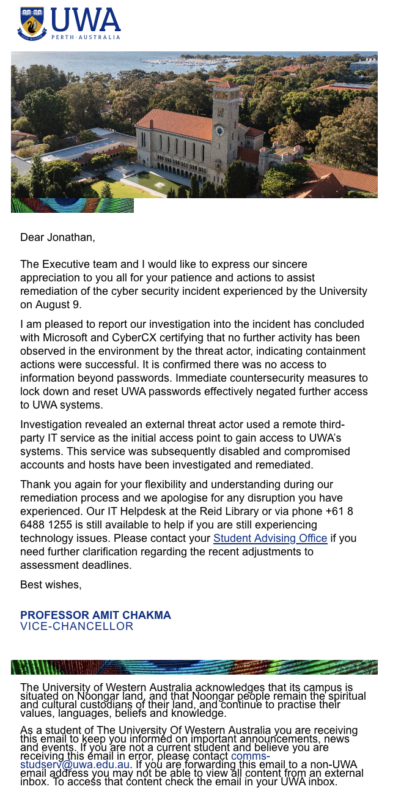

# A16. Discover 3 local security incidents

For this activity, I researched three local security incidents connected to Perth or Western Australia.

## 1. UWA data breach

In August 2025, the University of Western Australia reported a major cyber attack that exposed thousands of staff and student passwords.

## 2. WA government Microsoft 365 security incident

In March 2026, reports showed that weak Microsoft 365 security controls in some Western Australian government entities contributed to two serious incidents. 

https://audit.wa.gov.au/reports-and-publications/reports/microsoft-365-security-controls-state-entities/

## 3. Perth CBD public security incident

In January 2026, police investigated a major public security incident at a rally in Forrest Place in Perth CBD after a man threw an item into a crowd. The device was a homemade bomb. 

https://www.abc.net.au/news/2026-03-25/burke-says-luck-saved-lives-in-perth-bomb-plot/106493642
