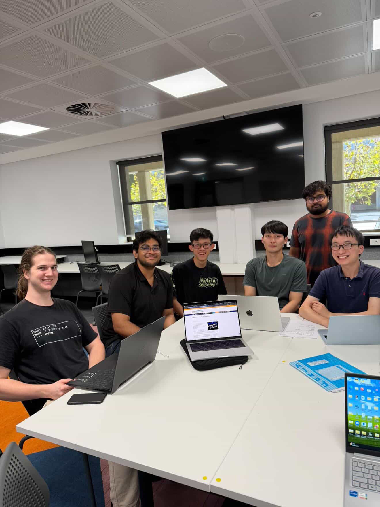

# A20. Participate in a discussion with your friends about cybersecurity event

For this activity, I had a discussion with my friends about a cybersecurity event related to **Cisco** and network device security.

We talked about how Cisco devices such as routers, switches, and firewalls are used in many organisations, which means that security vulnerabilities in these devices can have a serious impact. We discussed how attackers may exploit weak or unpatched systems to gain unauthorised access, interrupt services, or steal sensitive information.

Even Faiyaz from the team also mentioned that Mcdonald have 5 router.

During the discussion, we agreed that regular software updates, security patches, and network monitoring are important to reduce these risks.

