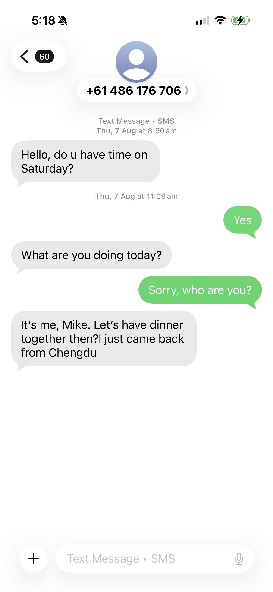

# A24. Teach Your Family About a Cybersecurity Topic

I taught my family about phishing scams and password safety. I explained how to spot suspicious links, avoid scam messages, use strong passphrases, and enable multifactor authentication to better protect accounts. 

I used simple examples that my family could relate to, such as fake delivery messages, suspicious banking emails, or scam links in social media and games. Teaching cybersecurity through everyday examples is recommended because it makes the lesson more understandable and practical for family members of different ages.

