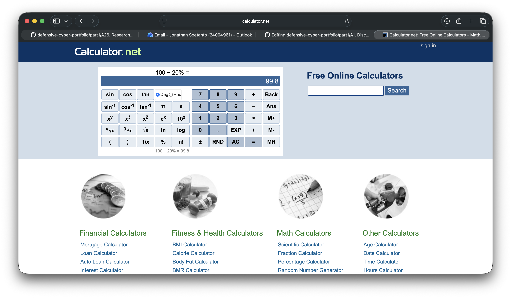

# A26. Research and implement a system bug

For this activity, I researched and demonstrated a simple **system bug** using online calculator.

## Description of the bug

A bug is an error or flaw in a system that causes it to behave incorrectly or produce the wrong result. It can simply be  in the system logic.

## Real-life example

The example I chose is a **calculation bug** in a simple system such as a calculator, shopping total, or discount system.

For example, if a system is supposed to calculate:

- Original price: $100
- Discount: 20%

The correct result should be:

- Final price: $80

However, because of a bug, the system may show the wrong answer, such as 99.8. This means the system is running, but its logic is wrong.

