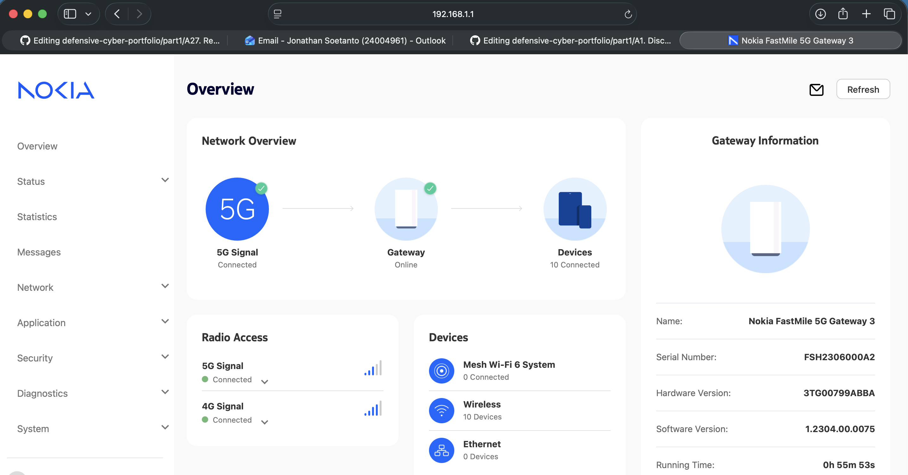

# A27. Research and implement a system vulnerability

a common real-life system vulnerability: **default passwords**.

## The vulnerability

A default password is the original username and password set by the manufacturer of a device or system. Many devices such as routers, CCTV, printers, and admin panels are shipped with default login details like `admin/admin` or `admin/password`.

This is a vulnerability because if the user does not change the default password, the other people may be able to guess it easily and gain unauthorised access to the system.

## Real-life implementation

To demonstrate this vulnerability in a safe way, I used my own example system in a controlled environment. I showed that if a device or system keeps its default password, it is much easier for someone to access it.

This shows that the vulnerability is not caused by advanced hacking, but by insecure setup and poor security practice.

