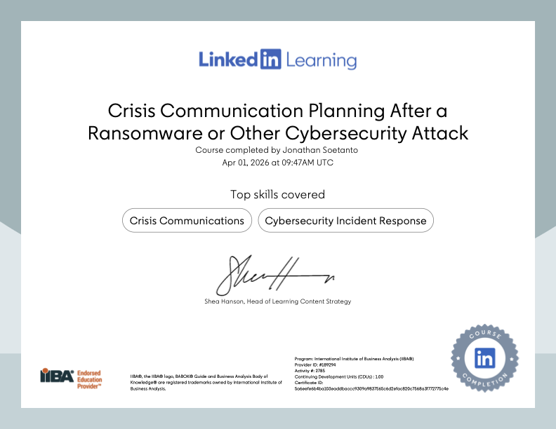

# A30. Complete an Online Cybersecurity Module

I completed an online cybersecurity module on LinkedIn Learning to improve my understanding of cyber threats and safe online practices. The module covered topics such as phishing, malware, password security, and cybersecurity awareness, and LinkedIn Learning provides a certificate of completion that can be used as evidence.

