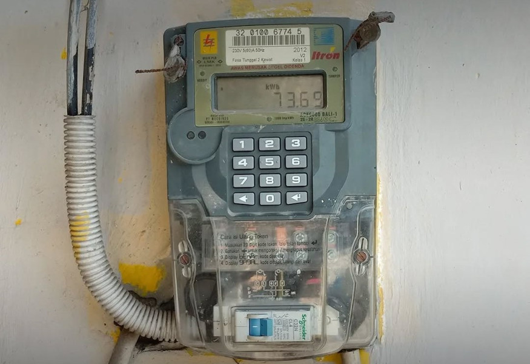

# A5 – Discover cryptographic implementation used online

## Investigation
I investigated how prepaid electricity tokens work in my home country Indonesia.  
When people buy electricity online or at a shop, they receive a 20 digit token code which must be entered into a digital electricity meter.  
The system uses cryptography so that only the correct meter can use the token and it cannot easily be guessed or reused.

## Cryptography used
Prepaid meters typically follow the STS (Standard Transfer Specification) standard.  
When a customer buys electricity:

- The utility backend generates a 20-digit token using the meter’s unique ID, the purchase amount, and a secret key.
- The token is encrypted using a symmetric-key algorithm so that only the matching meter, which has the same secret key stored inside, can decrypt and validate it.
- Inside the meter, the token is decrypted and checked (meter ID, amount, and a counter to prevent reuse). If it is valid, the meter balance increases.

This design means people can buy tokens online (website/app) or offline (shops), but the meter can still verify the token **offline** using cryptography.

## Why this is a cryptographic implementation
This system is an example of applied cryptography because it uses:

- **Encryption**: The 20-digit token encodes information in a secure way so it cannot be easily forged.
- **Authentication**: Only the correct meter with the right secret key accepts the token.
- **Replay protection**: Counters or similar techniques prevent the same token from being used more than once.

